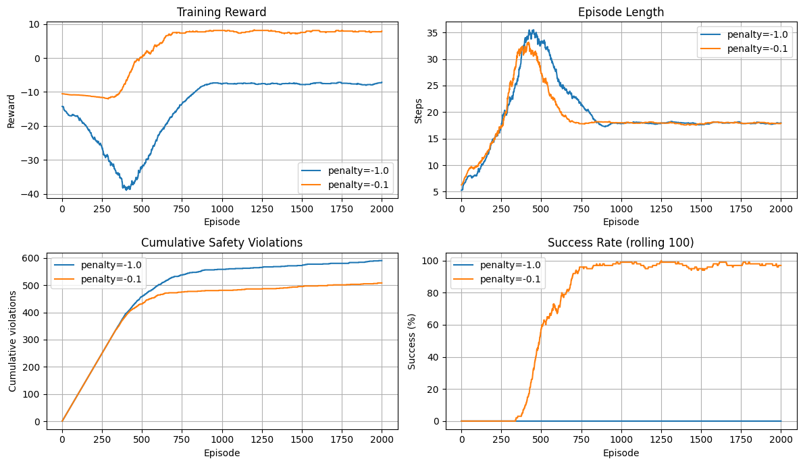
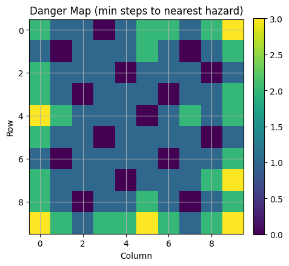
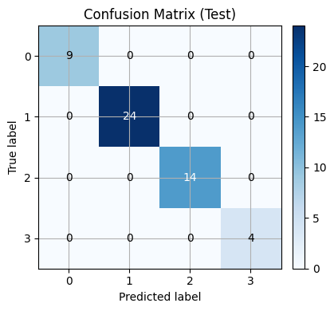
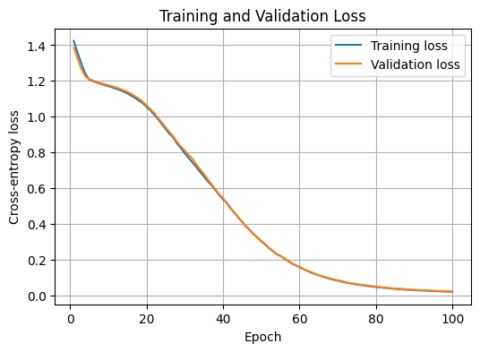
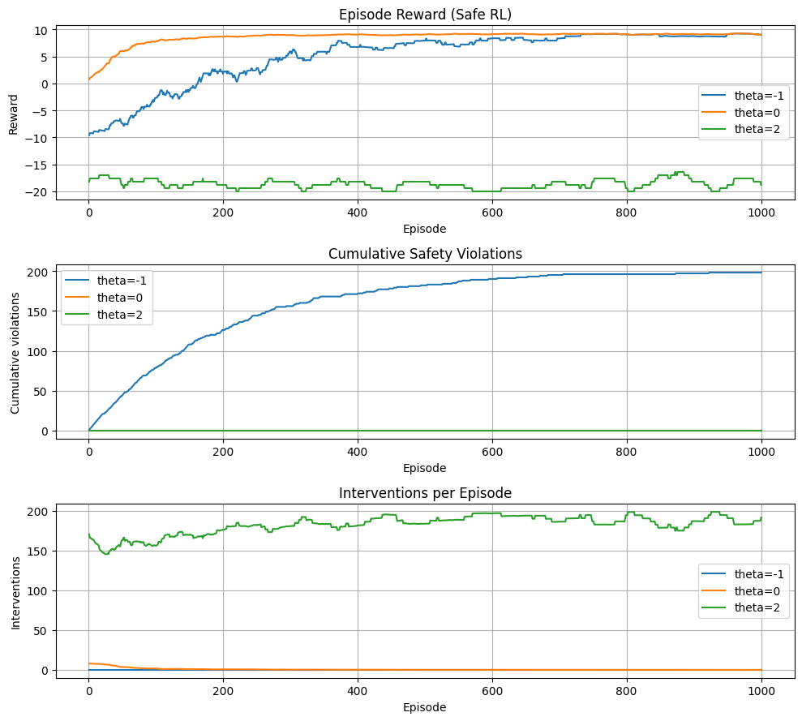

# Safe Reinforcement Learning with a Neural Safety Shield in GridWorld

This project implements a safe reinforcement learning workflow in a controlled GridWorld environment. It combines tabular Q-learning, graph-based danger-map supervision, a neural safety classifier, and shield-guided action intervention.

The main goal is to evaluate how a learned safety shield changes reinforcement learning behaviour: whether it can reduce unsafe exploration while still allowing the agent to learn effective policies.

## Project Overview

The workflow contains four main stages:

1. **GridWorld environment design**
   A 10×10 GridWorld is implemented with fixed hazard cells, a start state, a goal state, boundary handling, reward logic, and both fixed-start and random-start reset modes.

2. **Baseline Q-learning**
   A tabular Q-learning agent is trained without a safety shield to evaluate task learning, reward behaviour, path efficiency, and unsafe exploration.

3. **Danger-map supervision and safety dataset generation**
   A multi-source breadth-first search is used to compute each cell's distance to the nearest hazard. This danger map is then used to label valid state-action pairs into four risk classes.

4. **Neural safety shield and Safe RL integration**
   A feed-forward neural network is trained to predict the risk class of each state-action pair. The trained shield is then integrated into the Q-learning loop to intervene when a proposed action is predicted to be unsafe.

## Key Features

* Custom 10×10 GridWorld environment
* Tabular Q-learning baseline
* Multi-source BFS danger-map construction
* Complete state-action safety dataset generation
* Four-class neural safety shield classifier
* Shield-guided action selection with configurable risk thresholds
* Baseline RL vs Safe RL comparison
* Exported visualisations and metric summaries

## Repository Structure

```text
.
├── README.md
├── requirements.txt
├── .gitignore
├── Safe_Reinforcement_Learning_with_Neural_Safety_Shield_in_GridWorld.ipynb
│
├── assets/
│   ├── baseline_q_learning_comparison.png
│   ├── danger_map_heatmap.png
│   ├── safe_rl_threshold_comparison.png
│   ├── safety_shield_confusion_matrix_test.png
│   ├── safety_shield_confusion_matrix_val.png
│   └── safety_shield_loss_curves.png
│
└── reports/
    ├── baseline_metrics_summary_m0p1.csv
    ├── safe_rl_metrics_summary.csv
    ├── safety_shield_loss_curves.csv
    ├── safety_shield_test_metrics.csv
    └── safety_shield_val_metrics.csv
```

Generated datasets, Q-tables, model checkpoints, full episode logs, and archive files are treated as reproducible outputs. They are intentionally excluded from version control and can be regenerated by running the notebook.

## Methods

### 1. GridWorld Environment

The environment contains:

* 100 grid cells
* 15 hazard cells
* 4 discrete actions: up, down, left, right
* terminal goal and hazard states
* configurable step penalty
* fixed-start and random-start training modes

The environment returns transition information that allows both task performance and safety violations to be tracked during training.

### 2. Baseline Q-learning

The baseline agent uses a tabular Q-value representation over state-action pairs. It selects actions with an epsilon-greedy policy and updates Q-values using the standard Q-learning update rule.

The baseline experiment is used to evaluate how an unshielded reinforcement learning agent behaves before safety intervention is introduced.

### 3. Danger Map and Safety Dataset

A multi-source BFS starts from all hazard cells and computes the minimum distance from every grid cell to the nearest hazard.

Each valid state-action pair is labelled into one of four risk classes:

| Class | Meaning               |
| ----: | --------------------- |
|     0 | Immediate hazard      |
|     1 | One step from hazard  |
|     2 | Two steps from hazard |
|     3 | Safe                  |

The generated dataset contains 336 labelled state-action samples with 10-dimensional feature vectors.

Dataset split:

| Split      | Samples |
| ---------- | ------: |
| Train      |     235 |
| Validation |      50 |
| Test       |      51 |

### 4. Neural Safety Shield

The safety shield is a feed-forward neural network trained as a multi-class classifier.

Input features include:

* current position
* one-hot encoded action
* next position
* current distance to nearest hazard
* next-state distance to nearest hazard

The shield predicts the risk class for each candidate action before the RL agent executes it.

### 5. Shield-Guided Safe RL

During Safe RL training, the Q-learning agent first proposes an action. The safety shield then evaluates the proposed action.

An action is accepted only if its predicted class is greater than the selected threshold. Otherwise, the shield intervenes and replaces the proposed action with a safer alternative based on the available Q-values and predicted risk classes.

The project compares:

* no shield
* lenient intervention threshold
* strict intervention threshold

This makes the trade-off between safety, task performance, and intervention frequency visible.

## Results

### Baseline Q-learning

The baseline experiment shows how the unshielded Q-learning agent behaves before safety intervention is introduced.



Exported baseline summary:

| Configuration       | Success Rate | Average Reward | Average Length | Total Violations |
| ------------------- | -----------: | -------------: | -------------: | ---------------: |
| Step penalty = -0.1 |        97.4% |          7.785 |         17.948 |              508 |

The result shows that baseline Q-learning can learn a successful policy, but it still accumulates many hazard violations during exploration.

### Danger Map

The danger map provides a compact safety signal by measuring each cell's distance to the nearest hazard.



This graph-based supervision is used to construct the labelled safety dataset for shield training.

### Safety Shield Performance

The neural safety shield learns to classify state-action risk levels from the generated dataset.

Validation confusion matrix:


Test confusion matrix:



Training and validation loss curves:



In the saved run, the shield reached 100% validation and test accuracy on the generated GridWorld safety dataset.

| Split      | Overall Accuracy | Class 0 | Class 1 | Class 2 | Class 3 |
| ---------- | ---------------: | ------: | ------: | ------: | ------: |
| Validation |           100.0% |  100.0% |  100.0% |  100.0% |  100.0% |
| Test       |           100.0% |  100.0% |  100.0% |  100.0% |  100.0% |

### Safe RL Threshold Comparison

The final experiment integrates the trained safety shield back into the Q-learning loop and compares different intervention thresholds.



| Configuration | Success Rate | Average Reward | Total Violations | Avg. Interventions / Episode |
| ------------- | -----------: | -------------: | ---------------: | ---------------------------: |
| No shield     |        99.2% |          8.983 |              198 |                        0.000 |
| θ = 0         |       100.0% |          9.155 |                0 |                        0.668 |
| θ = 2         |         6.4% |        -18.083 |                0 |                      182.013 |

The lenient threshold achieved the best balance in this environment: it removed safety violations while keeping success rate and average reward high. The strict threshold also avoided unsafe transitions, but it intervened too frequently and prevented efficient learning.

## Main Takeaways

* Baseline Q-learning can learn the task but does not guarantee safe exploration.
* A danger map built from hazard locations provides a useful supervisory signal for safety classification.
* A compact neural shield can learn state-action risk labels in this controlled GridWorld setting.
* Shield-guided action intervention can remove unsafe transitions.
* Risk thresholds create a clear trade-off between task performance, intervention frequency, and safety strictness.

## Setup

Install dependencies with:

```bash
pip install -r requirements.txt
```

The main dependencies are:

```text
numpy
pandas
matplotlib
scikit-learn
torch
jupyter
```

## How to Run

Open the notebook:

```bash
jupyter notebook Safe_Reinforcement_Learning_with_Neural_Safety_Shield_in_GridWorld.ipynb
```

Then run the cells from top to bottom.

The notebook is organised into the following parts:

1. Notebook setup and shared utilities
2. Safe GridWorld environment
3. Core tabular Q-learning trainer
4. Baseline Q-learning experiments
5. Danger-map construction and dataset preparation
6. Safety shield classifier training
7. Shield-guided Safe RL training
8. Final artefact export and summary

Running the notebook can regenerate datasets, model files, Q-tables, logs, metric summaries, and plots.

## Colab and Local Execution Notes

This notebook was developed and tested primarily in Google Colab.

For local execution, install the dependencies from `requirements.txt` and run the notebook from the repository root. If the setup cell uses a fixed Colab path such as `/content/...`, update the project root path to the current repository directory before running locally.

A local-friendly setup pattern is:

```python
from pathlib import Path

PROJECT_ROOT = Path.cwd().resolve()
```

This allows generated folders such as `data/`, `models/`, `plots/`, `qtables/`, and `reports/` to be created relative to the current repository directory.

## Notes on Generated Files

The repository keeps the notebook, selected visualisations, and selected metric summaries.

The following generated artefacts are intentionally excluded from version control:

```text
data/
models/
qtables/
plots/
*.pkl
*.pt
*.pth
*.zip
full episode logs
```

These files can be recreated by running the notebook.

## Technologies Used

* Python
* NumPy
* Pandas
* Matplotlib
* scikit-learn
* PyTorch
* Jupyter Notebook

## Limitations

This project uses a small, controlled GridWorld environment. The safety dataset is generated from a known hazard layout, so the shield is trained with complete environment-derived supervision.

More realistic Safe RL settings may involve larger state spaces, partial observability, delayed feedback, stochastic transitions, or sparse human intervention signals.

## Future Extensions

Possible extensions include:

* testing larger and procedurally generated environments
* adding stochastic transitions or noisy observations
* replacing tabular Q-learning with deep Q-learning
* training shields from sparse intervention data instead of complete danger-map labels
* evaluating false-positive and false-negative trade-offs under distribution shift
* comparing rule-based shields with learned neural shields

## License

No open-source license is provided for this repository at this stage. The code and documentation are shared for viewing and reference only.
